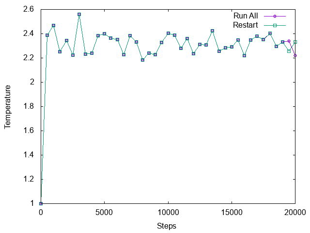

# Lammps リスタートサンプル

## 使い方

リスタートしないで20000ステップいっきに実行。

```sh
lmp_serial < runall.input
```

リスタートする場合。最初の10000ステップ。

```sh
lmp_serial < test.input
```

実行後、`test.restart.10000`というリスタートファイルができているため、これを`read_restart`コマンドで読み込んで残りの10000ステップを実行。

```sh
lmp_serial < restart.input
```

それぞれの温度の時間発展は以下の通り。



「Restart」の場合は10000ステップで一度中断しているが、途中までほぼ完全に同じ結果が得られている。ただし、数値誤差のために最後のほうで少しずれている。

## ライセンス

MIT
